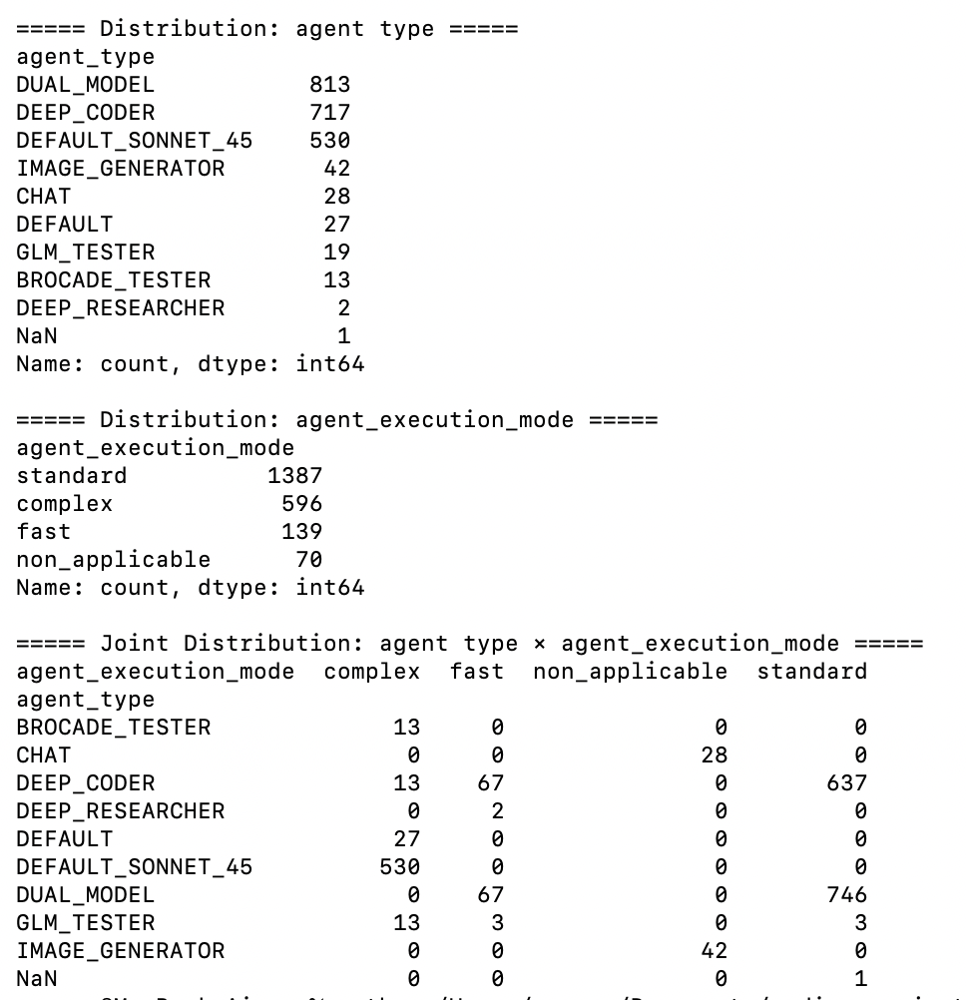
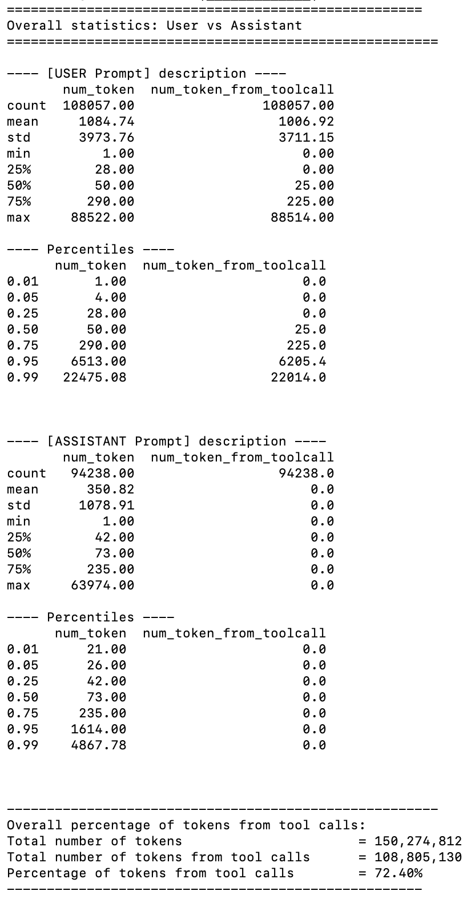
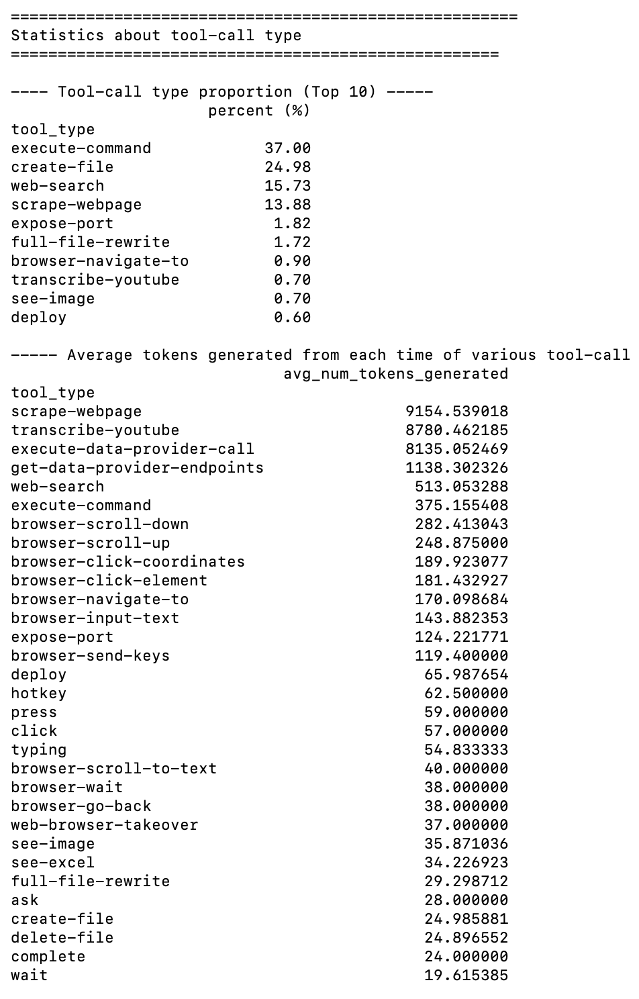
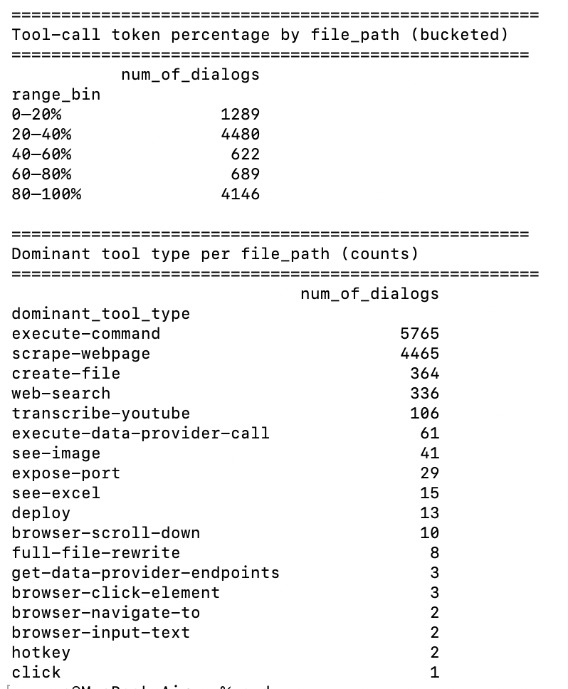

# Agent Trace & Prompt Analysis

This repo contains a small pipeline to download SuperNinja Agent chat logs from S3 Bucket, decompress them,
summarise their agent configuration, and analyse prompt/token usage. The purpose of this is to give some insight about optimisation direction towards prompt and context. 

The scripts are intentionally simple and focused on CLI usage.

## Environment

- Python 3.10.11 (tested with pyenv on macOS)
- macOS
- pyenv (optional but recommended)


## Installation

1. Clone this repo
```
git clone git@github.com:Sodiride123/SuperNinja-Agent-trace-prompt-analysis.git

cd SuperNinja-Agent-trace-prompt-analysis
```

2. (Optional) Select Python with pyenv
```
pyenv local 3.10.11
```

3. Create and activate a virtual environment
```
python -m venv .venv
source .venv/bin/activate
```         
          
4. Install dependencies
```
pip install -r requirements.txt
```

## Script Order & Examples 
### 1. Retrieve the compressed chat json from AWS S3 Bucket
Script: 1_obtain_json_gz_from_S3.py
- Reads a CSV containing an ID column (default column name: id). For each ID, lists objects in an S3 bucket with that ID as prefix. Finds the latest .gz object by LastModified and download it.

Key arguments
- --csv-path(required) : Path to the CSV containing IDs (please override it).
- --id-column : Column name that holds the IDs (default: id).
- --download-root(required) : Local root directory to store downloaded files.
- --bucket-name : S3 bucket name.
- --region-name : AWS region.

### 2. Uncompress the .gz collected by previous script
Script: 2_uncompress_the_gz.py
- Recursively searches for *.gz files under a given root directory. Decompresses each .gz to a file with the same name but without the .gz suffix.

Key arguments
- --download-root(required) : Root directory containing downloaded .gz files.

### 3. Anakyze agent mode and mode distribution
Script: 3_analyze_agent_distribution.py
- Walks through the directory with the successfully uncompressed data, collecting IDs from folder or file names. Joins these IDs back to the earliest CSV that contains at least:`id`, `agent_type`, `agent_execution_mode`

Key arguments
- --data-root(required)  : Root directory containing uncompressed ID folders or JSON files.
- --csv-path(required)  : CSV file with columns id, agent_type, agent_execution_mode.

Output example
<p align="left">
  
</p>

### 4. Extract user & assistant prompts
Script: 4_extract_user_and_assistant_prompts.py
- Recursively walks --json-root for decompressed JSON trace files. Collects content and role for messages where role is "user" or "assistant". Writes them into a CSV with various columns

Key arguments
- --json-root(required) : Root directory containing uncompressed ID folders or JSON files.
- --output-csv(required) : Output path for the prompts CSV.

### 5. Prompt / token analysis
Script: 5_analyze_prompts.py
- Generate some insight into the prompt.

Key arguments
- --csv-path(required) : Path to the prompts CSV produced by step 4.

Output examples
- An example to interpret the figure below: There are 108057 pieces of user prompt in total. The average number of toekns per user prompt is 1084.74.
<p align="left">
  
</p>

- An example to interpret the figure below: The execute-command tool-call type accounts for 37% of all tool calls; however, the tool call type with the highest average token output is scrape-webpage, with an average of 9,154.53 tokens per call
<p align="left">
  
</p>

- An example to interpret the figure below: Across all complete conversations, 4,146 conversations have more than 80% of their total tokens coming from tool calls; and 5,765 conversations have execute-command as their primary tool-call type
<p align="left">
  
</p>
